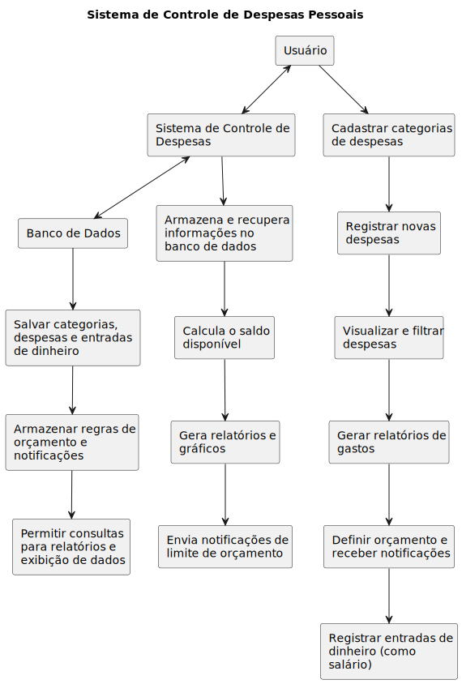

# Entregável 1 de Projeto e Desenvolvimento de Sistemas de Informação

**Alunos:**
- Andressa Oliveira Bernardes – 12121BSI201
- Dalmo Scalon Inácio – 12111BSI274
- Guilherme Castilho Machado – 12021BSI225
- Lucas Gabriel Dutra de Souza - 12121BSI226
- Matheus Fagundes Santos – 11811BSI300

## 1. Visão Geral do Sistema - Fornecer uma visão geral sobre como o problema poderia ser resolvido de forma computacional:

O Sistema de Controle de Despesas Pessoais é uma aplicação web que irá auxiliar os usuários a organizarem as suas finanças de maneira simples e eficiente, dando uma noção maior dos gastos, quanto está sendo gasto em cada área (lazer, moradia, alimentação, etc.) e quanto ainda pode ser gasto. Ele terá uma interface intuitiva, ajudando os usuários a acompanharem seus gastos e tomarem decisões financeiras mais eficientes.

**Os principais problemas que serão resolvidos são:**

- **Falta de organização financeira**
  - Muitas pessoas não têm controle dos seus gastos e acabam se perdendo, gastando mais do que podem e entrando em dívidas que a longo prazo podem acabar virando uma "bola de neve". Com este sistema, será possível registrar e categorizar suas despesas, assim como acompanhar o saldo.

- **Dificuldade em identificar gastos excessivos**
  - Como muitas pessoas não tem um registro claro de suas despesas, acabam não conseguindo identificar gastos excessivos. Este sistema permitirá a geração de relatórios e gráficos, nos quais o usuário poderá visualizar quais categorias estão consumindo mais o orçamento.

- **Dificuldade em monitorar o saldo disponível.**
  - Muitas pessoas gastam sem saber exatamente quanto ainda têm disponível. O sistema fará o cálculo automático do saldo conforme o registro das despesas.

- **Trabalho de registro de despesas manual**
  - Muitas pessoas ainda fazem registros manuais em cardenos ou planilhas. O sistema automatizará esse processo, sendo necessário apenas inserir dados como: saldo, categoria da despesa, data e valor.

### a) Faça um diagrama de blocos elencando os principais elementos do sistema e como eles relacionam entre si:

### b) Explique o funcionamento do sistema a partir do diagrama:

O diagrama representa 3 atores:

**Usuário:** registra, categoriza, visualiza e filtra (por categoria, data ou valor) as suas despesas, solicita o relatório de gastos, define orçamento e registra a entrada de dinheiro (como salário).

**Sistema de Controle de Despesas:** armazena e recupera informações no banco de dados, calcula o saldo disponível do usuário, gera o relatório e o gráfico.

**Banco de dados:** armazena todas as informações que o usuário registrou, além de realizar consultas para o sistema.

### c) Liste as principais tecnologias que podem ser usadas para desenvolver o sistema.

a. **Desenvolvimento Frontend**
   i. HTML, CSS, Javascript/Typescript
   ii. Bibliotecas Javascript: React, Axios
   iii. Bibliotecas CSS: Tailwind
   iv. Bundlers, Builders: Vite

b. **Desenvolvimento Backend**
   i. Javascript / Typescript (Node)

c. **Banco de Dados**
   i. PostgreSQL

d. **Controle de versão**
   i. Git / Github

e. **IDE/Editor de texto**
   i. VSCode

## 2. Análise de Viabilidade - Elaborar um breve relatório sobre a análise de viabilidade do problema/sistema

### a) Identificar os envolvidos:
- Clientes: usuários do sistema.
- Equipe de desenvolvimento: desenvolvedores do sistema.

### b) Principais Problemas/Restrições de Sistema
- O Sistema será executado em Plataforma Web com backend Javascript (Node) e frontend Javascript (React), sem implementação mobile.
- O Sistema irá permitir múltiplos usuários simultâneos.
- O Sistema não vai possuir compartilhamento entre objetos de usuários diferentes, dessa forma não serão implementadas funções como conta compartilhada ou despesas compartilhadas.
- O sistema vai rodar em plataformas gratuitas ou ambientes locais e estará sujeito as restrições de hardware associadas.

### c) Alternativas possíveis
- Substituir o Javascript no backend por Java, PHP, etc.
- Substituir o React no frontend por Javascript "puro", Angular, Vue, etc.

### d) Vantagens e desvantagens das alternativas:

**Vantagens**
   i. Alternativas como Java e PHP tendem a ser mais performáticas que implementações de Node.
   ii. No frontend, a substituição pelo Javascript "puro" diminuirá o tempo de execução do código.

**Desvantagens**
   i. Mais tempo de desenvolvimento no backend e no frontend.