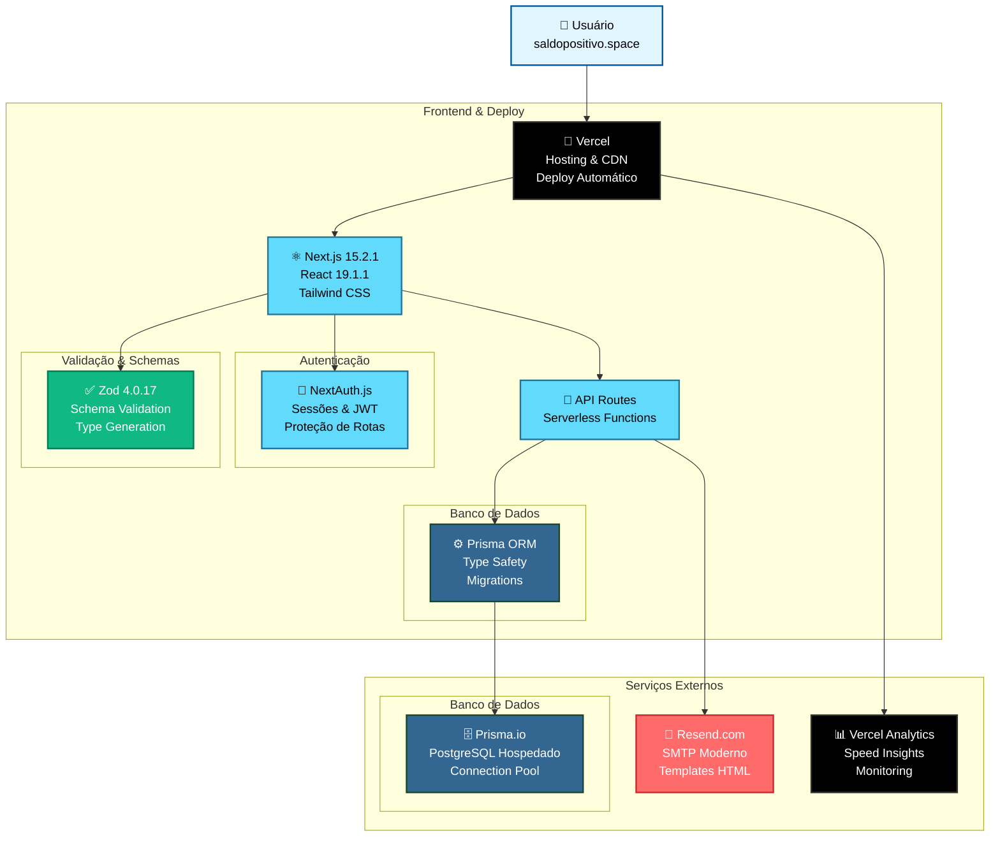
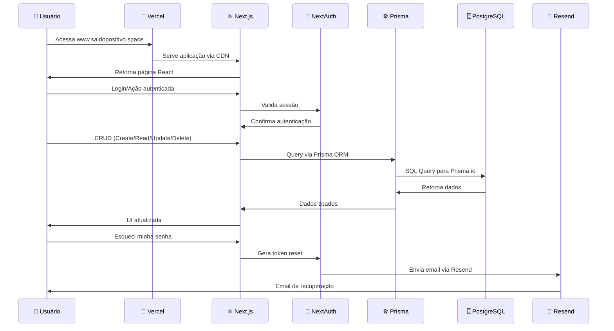

# Diagrama de Plataformas - Saldo Positivo

## Arquitetura de Produção

## Fluxo de Dados

## Stack Tecnológica Detalhada

| Categoria | Tecnologia | Versão | Função |
|-----------|------------|---------|---------|
| **Frontend** | Next.js | 15.2.1 | Framework React full-stack |
| | React | 19.1.1 | Biblioteca de componentes |
| | Tailwind CSS | 4.1.12 | Framework CSS utility-first |
| | TypeScript | 5.9.2 | Tipagem estática |
| **Backend** | Next.js API Routes | 15.2.1 | Serverless functions |
| | NextAuth.js | 4.24.11 | Autenticação e sessões |
| | Prisma | 6.14.0 | ORM e client database |
| **Database** | PostgreSQL | Latest | Banco relacional |
| | Prisma.io | - | Hosting PostgreSQL |
| **Validation** | Zod | 4.0.17 | Schema validation |
| **Email** | Resend | Latest | Serviço SMTP moderno |
| **Deploy** | Vercel | Latest | Hosting e CDN |
| **Monitoring** | Vercel Analytics | Latest | Métricas e performance |