# Diagrama de Plataformas - Saldo Positivo

## Arquitetura de Produção

```mermaid
graph TB
    User[👤 Usuário<br/>saldopositivo.space]
    
    subgraph "Frontend & Deploy"
        Vercel[🚀 Vercel<br/>Hosting & CDN<br/>Deploy Automático]
        NextJS[⚛️ Next.js 15.2.1<br/>React 19.1.1<br/>Tailwind CSS]
        subgraph "Autenticação"
            NextAuth[🔐 NextAuth.js<br/>Sessões & JWT<br/>Proteção de Rotas]
        end
        API[🔗 API Routes<br/>Serverless Functions]
        subgraph "Validação & Schemas"
            Zod[✅ Zod 4.0.17<br/>Schema Validation<br/>Type Generation]
        end
        subgraph "Banco de Dados"
            Prisma[⚙️ Prisma ORM<br/>Type Safety<br/>Migrations]
        end
    end
    
    

    
    subgraph "Serviços Externos"
        Resend[📧 Resend.com<br/>SMTP Moderno<br/>Templates HTML]
        Analytics[📊 Vercel Analytics<br/>Speed Insights<br/>Monitoring]
        subgraph "Banco de Dados"
            PrismaIO[🗄️ Prisma.io<br/>PostgreSQL Hospedado<br/>Connection Pool]
        end
    end
    
    
    
    User --> Vercel
    Vercel --> NextJS
    NextJS --> API
    NextJS --> NextAuth
    NextJS --> Zod
    API --> Resend
    API --> Prisma
    Prisma --> PrismaIO
    Vercel --> Analytics
    
    
    classDef userClass fill:#e1f5fe,stroke:#01579b,stroke-width:2px,color:#000
    classDef vercelClass fill:#000,color:#fff,stroke:#333,stroke-width:2px
    classDef reactClass fill:#61dafb,color:#000,stroke:#21759b,stroke-width:2px
    classDef databaseClass fill:#336791,color:#fff,stroke:#1a472a,stroke-width:2px
    classDef serviceClass fill:#ff6b6b,color:#fff,stroke:#c92a2a,stroke-width:2px
    classDef validationClass fill:#10b981,color:#fff,stroke:#047857,stroke-width:2px
    
    class User userClass
    class Vercel,Analytics vercelClass
    class NextJS,API,NextAuth reactClass
    class PrismaIO,Prisma databaseClass
    class Resend serviceClass
    class Zod validationClass
```

## Fluxo de Dados

```mermaid
sequenceDiagram
    participant U as 👤 Usuário
    participant V as 🚀 Vercel
    participant N as ⚛️ Next.js
    participant A as 🔐 NextAuth
    participant P as ⚙️ Prisma
    participant DB as 🗄️ PostgreSQL
    participant R as 📧 Resend
    
    U->>V: Acessa www.saldopositivo.space
    V->>N: Serve aplicação via CDN
    N->>U: Retorna página React
    
    U->>N: Login/Ação autenticada
    N->>A: Valida sessão
    A->>N: Confirma autenticação
    
    U->>N: CRUD (Create/Read/Update/Delete)
    N->>P: Query via Prisma ORM
    P->>DB: SQL Query para Prisma.io
    DB->>P: Retorna dados
    P->>N: Dados tipados
    N->>U: UI atualizada
    
    U->>N: Esqueci minha senha
    N->>A: Gera token reset
    A->>R: Envia email via Resend
    R->>U: Email de recuperação
```

## Stack Tecnológica Detalhada

| Categoria | Tecnologia | Versão | Função |
|-----------|------------|---------|---------|
| **Frontend** | Next.js | 15.2.1 | Framework React full-stack |
| | React | 19.1.1 | Biblioteca de componentes |
| | Tailwind CSS | 4.1.12 | Framework CSS utility-first |
| | TypeScript | 5.9.2 | Tipagem estática |
| **Backend** | Next.js API Routes | 15.2.1 | Serverless functions |
| | NextAuth.js | 4.24.11 | Autenticação e sessões |
| | Prisma | 6.14.0 | ORM e client database |
| **Database** | PostgreSQL | Latest | Banco relacional |
| | Prisma.io | - | Hosting PostgreSQL |
| **Validation** | Zod | 4.0.17 | Schema validation |
| **Email** | Resend | Latest | Serviço SMTP moderno |
| **Deploy** | Vercel | Latest | Hosting e CDN |
| **Monitoring** | Vercel Analytics | Latest | Métricas e performance |